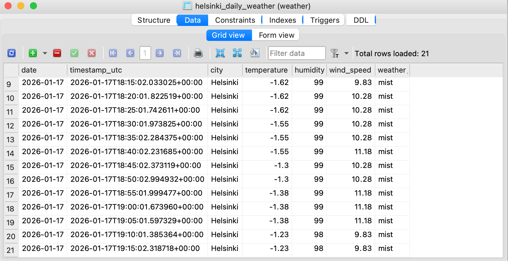

# Automated Weather ETL Pipeline

## Project Description

An end-to-end ETL pipeline that automatically fetches weather data from the OpenWeatherMap API, transforms it with Python and pandas, and loads it into a SQLite database. The pipeline is scheduled with cron for automated updates.

The goal of this project was to implement learning from courses and gain hands-on experience with automated data pipelines, working with APIs, and manipulating data using Python and pandas.

## Features

- **Data Extraction**: Fetches real-time weather data for Helsinki using OpenWeatherMap API
- **Data Transformation**: Converts JSON data into a pandas DataFrame
- **Data Loading**: Inserts data into a SQLite database with duplicate prevention (UNIQUE(timestamp_utc, city) and INSERT OR IGNORE)
- **Automation**: Cron setup for automatic scheduled runs
- **Secure Handling**: API key is stored in a .env file (not included in the GitHub repository)

## Technologies Used

- Python
- Pandas
- SQLite
- Requests
- Python dotenv
- Cron (macOS/Linux)

## Installation

**Note**:

- The SQLite database is **not included** in this repository. It will be created automatically when you first run the pipeline.

1. **Clone the repository:**

```bash
git clone https://github.com/LopJul/automated-weather-etl-pipeline.git
```

2. **Install dependencies:**

```bash
pip install pandas requests python-dotenv
```

3. **Add your OpenweatherMap API key to a .env file:**  
   OPENWEATHER_API_KEY = your_personal_api_key

4. **Run the pipeline manually:**  
   python main.py

5. **Optional: Set up cron to run the pipeline automatically on a schedule:**

To run the pipeline automatically every day at 08:00, add the following cron job:

```cron
0 8 * * * /Users/yourusername/weather-api-data/.venv/bin/python /Users/yourusername/weather-api-data/main.py >> /Users/yourusername/weather-api-data/log.txt 2>&1
```

**Note**:

- Update the paths to match your local project directory

- `> > log.txt 2>&1` ensures that both **successful runs and error messages** are saved to `log.txt` for monitoring and debugging

## Key Learnings

- How to fetch and work with data from an external API
- Structuring and transforming JSON data with pandas
- Using SQLite as a lightweight data store for structured data
- Handling duplicate entries and enforcing data integrity with SQL constraints
- Automating Python scripts using cron on macOS/Linux
- Using absolute paths to ensure that data files and SQLite database are always saved and accessed in the correct location

## Future Improvements

- Extend to include multiple cities
- Data visualization
- Migration to PostgreSQL

## Screenshots

Below is a screenshot of test data in the SQLite database. This test data was fetched automatically every 5 minutes during testing.



Below is a screenshot of the most recent 10 rows fetched from SQLite database. This screenshot was taken in VSCode terminal during testing.


